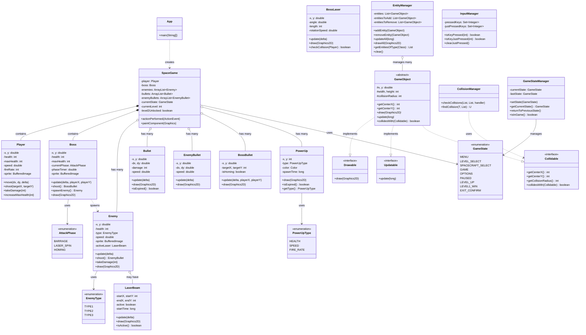

# Class Diagram (Mermaid Format)

## Quick View

This is a Mermaid class diagram version of the game architecture. 

**To view this diagram:**
1. Copy the mermaid code block above
2. Paste into [Mermaid Live Editor](https://mermaid.live/)
3. Or install Mermaid extension in VS Code

**Key Relationships:**
- **Implements** (dotted line with triangle): GameObject implements all 3 interfaces
- **Contains** (solid diamond): SpaceGame contains Player and Boss
- **Has many** (hollow diamond): SpaceGame has multiple Enemies, Bullets, PowerUps
- **Uses** (dashed arrow): Classes use enums and other dependencies
- **Creates** (dashed line): App creates SpaceGame instance

## Architecture Highlights

### 🎮 Main Components
- **SpaceGame**: Game loop, state management, rendering
- **Player/Enemy/Boss**: Core gameplay entities
- **Managers**: Modular systems for entities, collisions, state, input

### 🔧 Design Patterns
- **State Pattern**: GameStateManager
- **Strategy Pattern**: Boss AttackPhase system
- **Observer Pattern**: CollisionHandler callbacks
- **Composition**: GameObject + Interfaces

### 📦 Key Features
- 2 game levels (Boss mode, Endless mode)
- Level up system with 3 upgrade types
- 3 enemy types with unique behaviors
- Multi-phase boss with 3 attack patterns
- Physics-based movement with inertia
- Persistent progress saving

See `CLASS_DIAGRAM_DOCUMENTATION.md` for detailed explanation.
